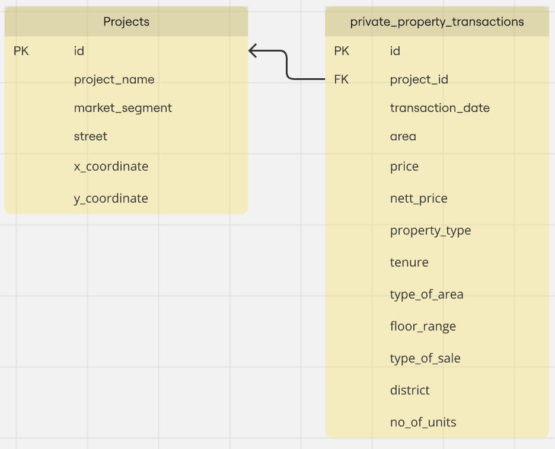
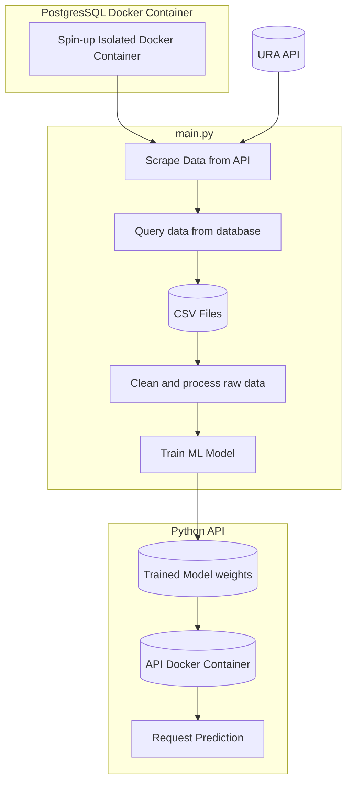

# Project Documentation

## Overview
This project aims to train a simple machine learning model to predict prices of Executive Condominiums (EC). The system involves setting up a PostgreSQL database in a Docker container, training a machine learning model, and exposing it as a RESTful API.
---

1. ## Setting Up PostgreSQL in Docker

To set up a PostgreSQL database in a Docker container for storing data from URA’s private residential property transactions API, follow these steps:

1.1 **Environment setup and usage**:
The repo uses conda to manage and set up the virtual environment
```bash
$ conda --version
conda 24.1.0
$ python --version
Python 3.11.5
```

1.2 **Environment setup and usage**:
To set up the repo and environment for usage, please run the following
commmands:

```bash
$ cd folder/to/clone/into
$ gh repo clone Lzwk16/URA_ML_pipeline
$ cd URA_ML_pipeline
$ conda env create --file=ura.yaml
```
1.3 **Running the module**:
1.3.1 Ensure relavant variables is in a `.env` file inside `URA_ML_pipeline`
   folder. Refer to the link to obtain the unique keys for the `ACCESS_KEY` and `TOKEN` [variables.](https://www.ura.gov.sg/maps/api/#private-residential-property-transactions)
```python

# required environment variable in .env file
POSTGRES_USER=URA_Master
POSTGRES_PASSWORD=SSG
POSTGRES_DB=property_transactions_db
ACCESS_KEY=<accesskey>
TOKEN=<token>
```
1.3.2 Run the following to spin up the dockerized PostgreSQL database:
```bash
$ conda activate ura-pipeline
$ docker-compose up -d
```
1.3.3  Run the following command to trigger the data processing and model
training pipeline
```bash
$ python src/main.py
```

2. ## Data Model


2.1 **Data and Model API Pipeline**



3. ## Folder Structure

```
├───conf                   <- config files.
│   └───base
├───notebooks              <- notebook for exploration.
├───src
│   ├───ura_pipeline       <- main entrypoint for all modules.
│   │   ├───data_prep
│   │   ├───database
│   │   ├───model
│   ├───tests
│   └───main.py            <- main.py for labeling reports.
├───ura.yml                <- `conda` environment file for reproducing the project.
├───app.py                 <- app.py file for exposing model as RESTful service
├───docker-compose.yml     <- config file to spin up docker container to set up SQL database
├───requirements.txt       <- environment file used by app.py to expose model as RESTful service
├───ura.Dockerfile         <- docker file to expose model as RESTful service
```
4. ## Python API for model prediction
To expose the model as a RESTful service a docker container, run the following
docker command while in the root directory:

```bash
docker build -t ml-model-api -f ura.Dockerfile .
docker run -d -p 8080:8080 ml-model-api
```

Once done, you can perform predictions by sending a POST request using `curl`
command in the terminal with the following format:
```bash
curl -X POST http://127.0.0.1:8080/predict \
-H "Content-Type: application/json" \
-d '{"area": 120, "type_of_sale": 3, "district": 20, "market_segment": "OCR", "x_coordinate": 30143.47773, "y_coordinate": 36550.59541, "year": 2021, "month": "01", "remaining_lease": 76, "middle_story": 5}'
```


5. ## Model Monitoring Metrics
To ensure the model remains effective over time, propose the following monitoring metrics:

a. Prediction Accuracy: Track the difference between predicted and actual prices
(e.g., MAE, RMSE).

b. Data Drift: Monitor changes in the input data distribution that could affect
model performance (e.g. whylogs).

c. Model Performance Over Time: Analyze performance trends to detect
degradation (e.g. whylogs).

d. Feature Importance Tracking: Regularly assess the importance of features to
identify shifts.

6. ## Automation of Processes

To streamline automation processes, the following can be:

a. **Feature Engineering Automation**:
Use pipelines (e.g., Apache Airflow, Kedro) to automate data preprocessing and
feature extraction.

b. **Model Selection Automation**:
Implement AutoML frameworks (e.g., TPOT, H2O.ai) to automate the selection and
tuning of ML models based on validation performance.

c. **Model Monitoring Automation**:
Set up automated alerts for performance metrics and data drift, allowing for timely model retraining.

7. ## Model Governance Processes

To ensure responsible use of the model, implement the following governance processes:

a. **Access Controls**:
Restrict access to model and data resources to authorized personnel only,
utilizing role-based access control.

b. **Versioning Models**:
Use model versioning systems (e.g., MLflow) to manage different iterations of
the model and facilitate rollback if needed.

c. **Testing for Model Bias**:
Regularly test the model for bias using fairness metrics and techniques to
ensure no geographical bias exists.

d. **Documentation**:
Maintain thorough documentation of the model development process, data sources, and evaluation metrics to promote transparency.